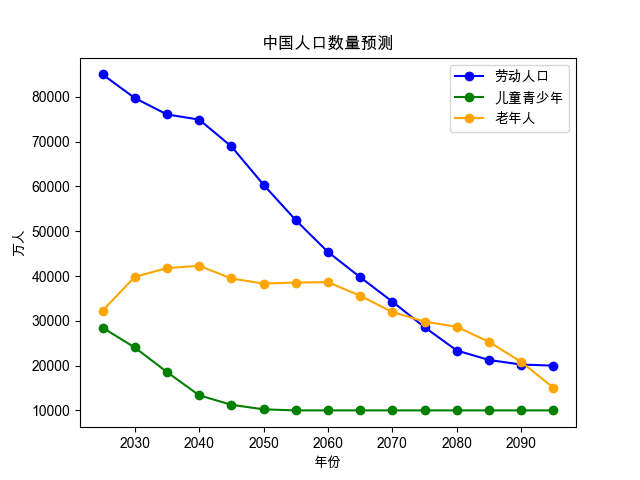
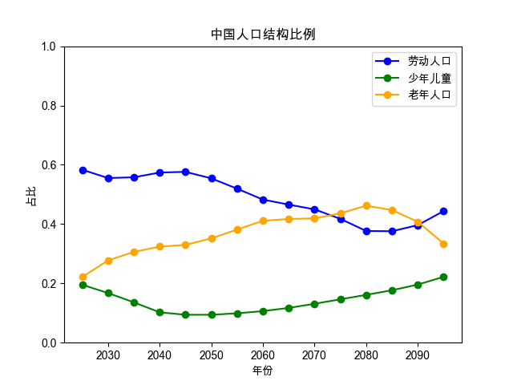
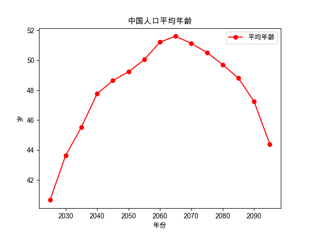

# 中国人口老龄化的计算

## 数据来源：

`born.csv` 包含了中国从1949年到2022年的出生人数。

## 标准：
- 0-20岁为青年儿童
- 20-60岁为工作人群
- 60岁以上为老年人群

## 假设：

- 新生儿数量将从2023年开始每年减少5%，直到每年达到500万。
- 人们的平均寿命为78岁。（有些人会早逝，有些人会长寿，但平均值为78岁。）
- 不考虑人口迁移，因为中国有严格的迁移政策。
- 不考虑1949年以前出生的人，他们不会影响趋势。

## 程序

`main.py` 计算和预测中国人口老龄化情况。

## 结果:
**各年龄段人口数走势图**

**人口结构占比走势图**

**人口平均年龄走势图**

